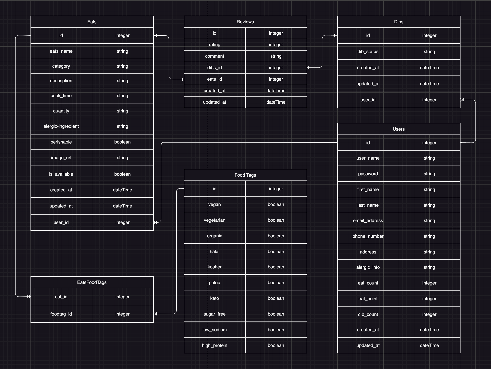
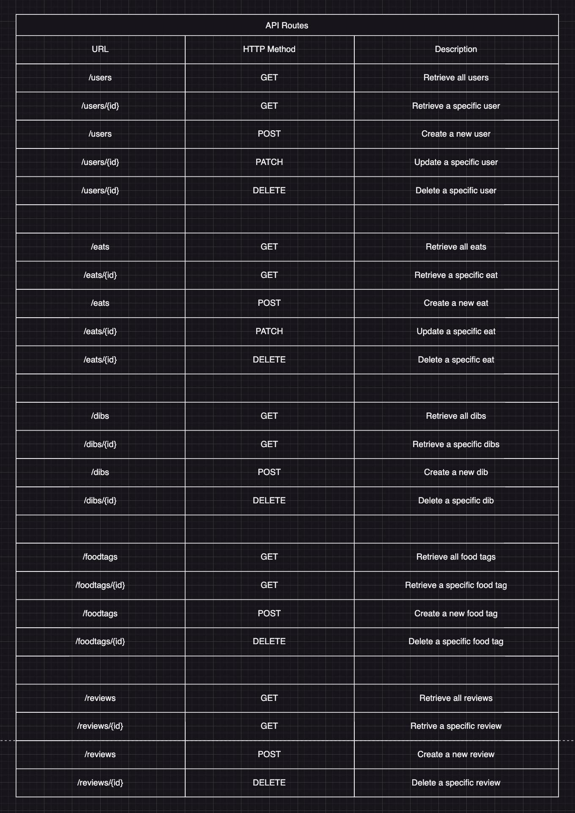

# CommunityFeast

<!-- Headings -->

## Description

CommunityFeast is an innovative food sharing platform that aims to reduce food waste and strengthen connections within local communities. 

## Requirements before running the app

Check the requirements before you run the app:

- You have installed [Git](https://git-scm.com/).
- You have a [GitHub](https://github.com/) account.
- You have installed [Node.js](https://nodejs.org/) and [npm](https://www.npmjs.com/get-npm).
- You have installed [Python](https://www.python.org/) and [pipenv](https://pipenv.pypa.io/en/latest/).
- You have installed [Honcho](https://honcho.readthedocs.io/en/latest/) (to manage Procfile-based applications).

## Getting Started

Follow these steps.

### Setting up front-end

1. Clone the repository:

   ```bash
   git clone git@github.com:your-username/Community-Feast.git
   ```

2. Navigate to the client (front-end directory):

   ```bash
   cd client
   ```

3. Install npm packages:

   ```bash
   npm install
   ```

### Setting up back-end

1. Go to the root directory of the project.

2. Install pipenv and dependencies:

   ```bash
   pipenv install
   ```

3. Run the virtual environment:

   ```bash
   pipenv shell
   ```

### Db file Setup

1. Go to the data directory (in this case, instance folder):

   ```bash
   cd server/instance
   ```

2. Create a app.db file:

   ```bash
   touch app.db
   ```

3. Move data from the SQL file to db file:

   ```bash
   sqlite3 app.db < app.sql
   ```

## Running the App

1. Go to the root directory of the project.

2. Start the application using Honcho:

   ```bash
   honcho start -f Procfile.dev
   ```

## Wireframe

### Pages


## User Stories

1. Users can POST their surplus food on the Eats page.
2. Users can SEE, UPDATE, and DELETE their Eats through UserAccount page when they log in.
3. Users can Dib food through DibButton which is stay under the EatsDetail page
4. Users can DELETE Dibs through UserAccount page.
5. Users can view information about the site on the “About” page.
6. Users can register on the website, where they set up a unique username and password.
7. Users can log into the website to make Eats and Dibs.
8. Admin users can manage Users, Eats, and Dibs on the website.

## React Components Tree


## Database Schema



## Constraints

- All users should have an unique usernames
- A user can make only one dib within a specific period of time to prevent food waste and not interfere with others' chances to get food.
- Admin user should only be allowed to edit all users info, Eats, and Dibs status


## Validations

- Ensure the eats ratings and dibs ratings are integers.
- Check the phone number and email address format in the users table 
- address must be unique
- Quantity in the Eats table must be an integer
- Eats count and Dibs count must be an integer
- Reservation status must be a valid string value
- Email address must be in a valid format
- The name of the user must be non-empty
- The username and password of the user must be non-empty
- Rating must be between 1 and 5
- Review comments must be non-empty

## API Routes



## Example of a Response Structure

GET /eats


## React Routes


## Stretch Goals

1. Eats Users can track Dibs users real time location through the app.

2. Users can receive text messages or an email regarding when somebody Dibs their Eats.

3. Users can use the application in various languages.

## Trello Board

